# Блог микро кухни

рецепты на одного человека
----

### Стек

+ Tailwind
+ Alpine.js
+ chi
+ go
+ Yandex.Cloud Object Storage

## Цель

Игровое приложение. Рецепты идут цепочками, как перки в игре, скачала ты готовишь блины, потом оладьи потом блины с яблоком. Так прокачиваешь блинную тему. Он не приготовив оладьи ты не откроишь блины. В какой-то момент надо зарегистрироваться, чтобы смотреть рецепты. 

Ты отмечаешь какие рецепты приготовил. 

```mermaid
---
title: Микро-кухня
---
flowchart LR
    b1((Блины)):::blini -->b2
    b2((Оладьи)):::blini -->b3((Яйцо+банан))
    b3:::blini-->c1(((Дзингар хатц)))
    s1((Салат))-->s2
    s2((армянская окрошка))-.->c1
    s2-->s3((свекольный салат))
    s3-->s4((...))
    c1:::blini-->c2{зарегистрируйтесь}:::buy
    c2:::blini-->c3((...))
    c3:::blini-->c4((эпичные блины))
    x((эпичный сырник))-->c4
    c4:::blini-->c5{Купите подписку!}:::buy

class c5 blini;
classDef buy  stroke:yellow,stroke-width:4
classDef blini fill:#00002e


```

В какой-то момент ветку придётся купить, или купить подписку, и готовить дальше, писать комменты, выкладывать фоточки, общаться!

Народ привлекается сюда тиктоком, ерекламируцетя в блогах

## Монетизация

С подписок и покупок веток